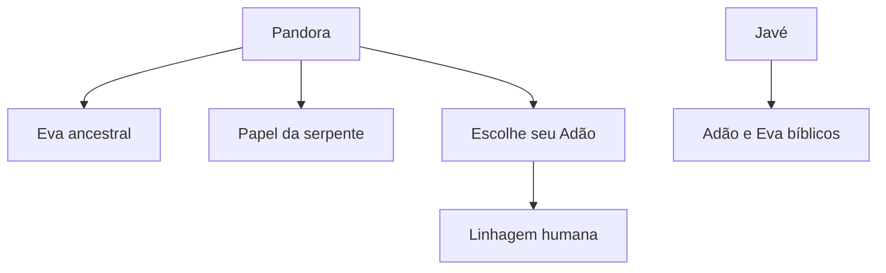

# Relações entre personagens, nomes e epítetos

As fontes estudadas pelo Projeto Universalismo frequentemente aproximam personagens de tradições diferentes. Algumas afirmam que dois nomes designam a mesma entidade; outras reutilizam títulos como **Adão** e **Eva**, atribuem a um personagem um papel simbólico ou descrevem relações de parentesco, analogia e reencarnação.

Essas relações não são equivalentes. Este mapa existe para registrar **o tipo de vínculo que cada fonte realmente estabelece**, evitando transformar semelhança em identidade ou papel simbólico em reencarnação.

## Como ler as relações

| Tipo de relação | Significado neste mapa | Exemplo |
|---|---|---|
| Identidade declarada | A fonte afirma que nomes diferentes designam a mesma entidade | Caos / Brahma / Javé em *O Sorriso de Pandora* |
| Epíteto | Um título ou função pode ser aplicado a indivíduos diferentes | Adão e Eva como epítetos de uma geração |
| Papel narrativo | Um personagem desempenha a função associada a outro símbolo | Pandora no papel da serpente do Éden |
| Parentesco | A fonte estabelece filiação, irmandade ou descendência | Pandora e Atena como filhas de Zeus |
| Analogia | A fonte compara escolhas ou trajetórias sem afirmar identidade | Pandora e Arwen |
| Reencarnação | A fonte afirma vidas sucessivas da mesma consciência | Três vidas humanas posteriores de Pandora na palestra, sem nomes |
| Hipótese de identidade | Há aproximação, mas falta confirmação explícita | Sidarta comunicante e Sidarta Gautama histórico |
| Distinção explícita | A fonte impede que dois personagens sejam fundidos | Adão de Pandora e Adão bíblico |

## Núcleo de Pandora, Adão e Eva

Segundo *O Sorriso de Pandora*, de Jan Val Ellam, e sua paráfrase oral na palestra **Pai João de Angola e Sidarta Buda / Adão e Eva**, Pandora não é simplesmente a personagem da mitologia grega conhecida pelo jarro. A obra a apresenta como participante de uma longa antropogênese espiritual, ligada à formação de linhagens humanas, à liberdade psíquica e ao episódio posteriormente conhecido como Jardim do Éden.

O diagrama representa relações internas da narrativa espiritual. Ele não afirma que a mitologia grega, o texto bíblico ou a história acadêmica apresentem originalmente a mesma interpretação.

### Pandora como Eva ancestral

A obra apresenta Pandora como uma **Eva anterior ao casal bíblico**. Ela assume condição humana, escolhe um homem de seu grupo e forma com ele uma descendência. A palestra chama esse homem de “Adão da sua Eva, Pandora”.

Essa relação é de **epíteto e função ancestral**, não de reencarnação:

- Pandora ocupa a função de Eva de uma linhagem;
- seu companheiro ocupa a função de Adão;
- eles não são o casal bíblico posterior;
- os nomes verdadeiros desses indivíduos não são informados.

### Adão e Eva como epítetos

A palestra declara que “Adão e Eva são epítetos de uma geração de Adões e de Evas”. Assim, a narrativa distingue:

1. Pandora como Eva ancestral;
2. o Adão escolhido por Pandora;
3. o Adão bíblico;
4. a Eva bíblica;
5. outros Adões e Evas anteriores, não identificados nominalmente.

Portanto:

- **Adão de Pandora ≠ Adão bíblico**;
- **Pandora/Eva ≠ Eva bíblica**;
- Adão e Eva funcionam como títulos aplicados a diferentes personagens.

### Pandora no papel da serpente

Quando Javé escolhe outro casal para seu projeto no Jardim do Éden, Pandora interfere para impedir sua continuidade. *O Sorriso de Pandora* formula essa relação em primeira pessoa: ela teria feito o papel da serpente.

Isso deve ser lido como **papel narrativo declarado pela personagem**, e não como prova de que Pandora tenha assumido literalmente a forma física de uma serpente ou reencarnado como outro ser.

### Reencarnações posteriores

A palestra afirma que Pandora teve **três reencarnações humanas** depois da grande devastação. *O Sorriso de Pandora* fala em reencarnações humanas posteriores, mas não fixa o número três no trecho confrontado.

Nenhuma das fontes consultadas identifica os nomes dessas vidas. O mapa registra apenas:

> Pandora → reencarnações humanas posteriores, ainda sem identidades conhecidas.

Não há base, neste material, para atribuir a Pandora uma personagem histórica posterior.

## Nomes equivalentes e personagens distintos

### Caos, Brahma e Javé

*O Sorriso de Pandora* associa **Caos, Brahma e Javé** como nomes ou manifestações da entidade criadora dentro de sua cosmologia. A palestra reproduz essa fórmula ao dizer “Brama ou Jahé ou Caos, tanto faz o nome”.

Esta é uma **identidade declarada pela fonte espiritual**, que deve ser preservada como parte do modelo de Jan Val Ellam. Ela não significa que as tradições grega, hindu e bíblica façam originalmente essa identificação.

### Zeus e Javé

Apesar de uma aproximação oral presente na palestra, *O Sorriso de Pandora* mantém os personagens distintos:

| Zeus | Javé |
|---|---|
| ser demo ligado ao Olimpo | criador associado a Caos/Brahma |
| pai de Pandora e Atena | responsável pelo projeto do casal bíblico |
| busca controlar Pandora e os humanos | persegue a liberdade psíquica transmitida por Pandora |

A regra editorial é, portanto: **Zeus ≠ Javé no livro**. A aproximação feita na palestra permanece registrada como formulação exclusiva dos comunicantes.

### Zeus e o personagem mitológico

A palestra descreve o líder da estirpe do Olimpo como o ser conhecido principalmente na mitologia pelo nome **Zeus**. Trata-se de uma identificação entre um personagem da cosmologia espiritual e a figura preservada pela tradição mitológica grega.

Isso não demonstra que a releitura espiritual seja o sentido original dos textos gregos. As duas camadas devem permanecer comparáveis e distintas.

### Olimpianos e devas

A palestra afirma que os olimpianos seriam os “vedas” da cultura hindu — provável transcrição de **devas**. A relação não foi localizada em *O Sorriso de Pandora* e a palavra ainda depende de confirmação auditiva.

Classificação atual: **equivalência exclusiva da palestra, com termo incerto**.

## Parentescos e grupos

| Relação | Fonte e tratamento |
|---|---|
| Pandora → filha/descendente de Zeus | Direta no livro e na palestra |
| Atena → irmã de Pandora e filha de Zeus | Direta no livro e na palestra |
| Prometeu ↔ Epimeteu | Irmãos titãs |
| Cronos → chefe do clã dos titãs | Direta no livro e na palestra |
| Pandora + Epimeteu → Pirra | Filha gerada “à moda demo” |
| Pandora + seu Adão → filha humana | Filha sem nome informado |
| Nephelim → clã de Enki | Relação localizada no livro |
| grupo de Sírius → contribuição humana | Participação direta; influência encerrada pela grande devastação |

O termo “Clud” da transcrição não representa, até o momento, um personagem ou grupo. O confronto com o livro mostrou que o papel atribuído a ele pertence aos **Nephelim do clã de Enki**, tornando provável que “Clud” seja ruído de transcrição de “clã [de Enki]”.

## Analogias que não são identidades

### Pandora e Arwen

A comparação com Arwen e Aragorn, de *O Senhor dos Anéis*, está no próprio *O Sorriso de Pandora*. Ela explica a escolha de Pandora por uma condição humana, assim como Arwen escolhe a mortalidade em razão de sua ligação com Aragorn.

A relação é exclusivamente analógica:

- Pandora não é apresentada como Arwen;
- Aragorn não é apresentado como o Adão de Pandora;
- não existe afirmação de reencarnação entre esses personagens.

### Pandora e a lagarta que se torna borboleta

Em outro material do corpus, Despina compara a transformação de Pandora à passagem da lagarta para a borboleta. É uma imagem explicativa da mudança de condição, não uma identidade entre personagens.

## Sidarta: identidade ainda aberta

Na palestra, o comunicante declara em 5:41: “Eu me chamo Sidarta”. O título do vídeo o identifica como **Sidarta Buda**. Contudo, a comunicação não desenvolve uma afirmação biográfica que permita equipará-lo automaticamente ao [Sidarta Gautama](../../../Personagens/Sidarta-Gautama.md) histórico.

O projeto preserva três níveis:

- autodeclaração do comunicante: **Sidarta**;
- identificação editorial do vídeo: **Sidarta Buda**;
- personagem histórico-religioso: **Sidarta Gautama**.

A identidade entre os três permanece aberta até confirmação explícita da fonte ou do Mestre.

## O que a fonte não afirma

Este núcleo não fornece nomes para as encarnações humanas posteriores de Pandora. Também não afirma que:

- Pandora seja a Eva bíblica;
- o Adão de Pandora seja o Adão bíblico;
- Pandora tenha reencarnado como Arwen;
- Zeus e Javé sejam a mesma entidade em *O Sorriso de Pandora*;
- Sidarta tenha declarado na fala ser Gautama;
- personagens semelhantes de culturas diferentes sejam automaticamente o mesmo espírito.

## Relações com o acervo

- [Pandora](../../../Personagens/Pandora.md)
- [Zeus](../../../Personagens/Zeus.md)
- [Javé](../../../Personagens/Javé.md)
- [Sidarta Gautama](../../../Personagens/Sidarta-Gautama.md)
- [Pai João de Angola](../../../Personagens/Pai-João-de-Angola.md)
- [Jan Val Ellam](../../../Personagens/Jan-Val-Ellam.md)
- [Mitologia Grega](../../../Estudos/Mitologia-Grega.md)
- [A Pré-História Espiritual da Humanidade](../A-Pré-História-Espiritual-da-Humanidade.md)
- [Capítulo 10 — Pandora, Eva e o rompimento do modelo colmeia](../capitulos/10-pandora-eva-e-modelo-colmeia.md)

## Fontes deste núcleo

- Jan Val Ellam, *O Sorriso de Pandora* — fonte literária direta para a maior parte das relações.
- Jan Val Ellam, *A Divina Colmeia — A Trimurti Desencantada* — “deslacre mental” de Pandora (~48 mil anos) e atuação posterior de Eva (~23 mil anos).
- Palestra **Pai João de Angola e Sidarta Buda / Adão e Eva** — comunicação de Sidarta e Pai João de Angola através de Pedro Augusto; paráfrase oral amplamente fiel de *O Sorriso de Pandora*, com ampliações identificadas separadamente.
- Palestra **Pai João de Angola e Helma / Identidades de gêneros, homoafetividade e espiritualidade** — comunicação relacionada ao relato de Despina.

## Regra de crescimento

Novas relações devem ser acrescentadas somente quando uma fonte identificável afirmar ou sustentar o vínculo. Cada entrada deve responder:

1. quais personagens estão relacionados;
2. qual fonte cria a relação;
3. se é identidade, epíteto, papel, parentesco, analogia, reencarnação ou hipótese;
4. se outras fontes confirmam, divergem ou permanecem silenciosas;
5. o que não se pode concluir.

Assim, o mapa poderá crescer para outros núcleos — Hermes/Thoth, Jesus/Sananda, personagens atlantes e figuras de outras tradições — sem transformar aproximações em identidades automáticas.
