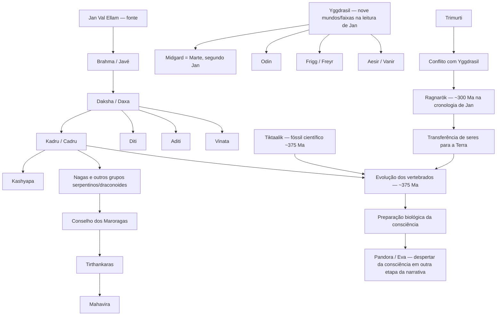

# Mapa de relações — “Quando a Terra estava vestida de branco”

Este mapa organiza os **personagens, grupos, mundos, eventos, tradições e marcos cronológicos** citados por Jan Val Ellam na palestra **“Quando a Terra estava vestida de branco | VSC#44”**.

O objetivo é permitir que a palestra deixe de ser uma informação isolada e passe a integrar o restante do repositório, mantendo separadas:

- a tradição mitológica de origem dos nomes;
- a releitura espiritual/cosmológica de Jan Val Ellam;
- os marcos científicos que podem ser comparados;
- as relações internas já existentes no Projeto Universalismo.

## 1. Visão geral da narrativa

> O diagrama representa **relações afirmadas ou sugeridas na palestra**, e não uma árvore factual única aceita pela história, mitologia ou ciência.

## 2. Cronologia integrada da palestra

| Faixa temporal | Elemento | Natureza | Relação no projeto |
|---|---|---|---|
| ~970 milhões de anos | início dos “biodemos”, segundo Jan | espiritual/cosmológica | amplia a pré-história da consciência para antes da humanidade |
| ~800–750 milhões de anos | “Terra vestida de branco” | cronologia de Jan | comparar com Criogeniano/Snowball Earth (~720–635 Ma) |
| após o descongelamento | desenvolvimento da vida aquática e complexificação | ciência + interpretação espiritual | Jan introduz possibilidade de semeadura/intervenção externa |
| ~500 milhões de anos | conflito da Trimurti com Yggdrasil | espiritual/cosmológica | conecta tradição hindu e cosmologia nórdica dentro da Revelação Cósmica de Jan |
| ~500–400 milhões de anos | Marte/Midgard e Yggdrasil como centro desenvolvido | espiritual/cosmológica | Odin, Frigg, Freyr, Aesir e Vanir aparecem ligados ao sistema |
| ~375 milhões de anos | Tiktaalik e transição água–terra | científica | marco paleontológico comparado à intervenção de Kadru |
| ~375 milhões de anos | equipes de Kadru atuam sobre formas aquáticas | espiritual/cosmológica | Nagas e seres serpentinos/draconoides entram na narrativa terrestre |
| ~300 milhões de anos | Ragnarök / ruptura de Yggdrasil e Marte | espiritual/cosmológica | transferência de seres para a Terra |
| ~300–270 milhões de anos | últimas gerações de “biodemos” citadas na palestra | espiritual/cosmológica | etapa tardia da preparação biológica segundo Jan |
| muito depois | Tirthankaras e Mahavira | religiosa/jainista reinterpretada por Jan | Jan vincula o Conselho dos Maroragas aos Tirthankaras |
| etapa humana | Pandora/Eva e despertar da consciência | espiritual/cosmológica | conecta esta palestra às obras já estudadas de Jan |

## 3. Personagens e entidades

| Nome normalizado | Forma na transcrição | Tipo | Já possui página? | Relação principal |
|---|---|---|---|---|
| [Jan Val Ellam](../../../Personagens/Jan-Val-Ellam.md) | Jan Val Ellam | autor/comunicador | Sim | fonte da palestra |
| [Javé](../../../Personagens/Javé.md) | “Brama ou Javé” | personagem cosmológico/religioso | Sim | Jan identifica Brahma/Brama com Javé nesta narrativa |
| Brahma | Brama/Bran | divindade/conceito da tradição hindu | Não | origem de descendências “regeneradas” segundo Jan |
| Daksha | Daxa/Daxha | personagem da tradição hindu | Não | pai de diversas filhas, incluindo Kadru, na genealogia usada por Jan |
| [Kadru](../../../Personagens/Kadru.md) | Cadru | personagem da tradição hindu | **Criada neste estudo** | ligada a Kashyapa, Nagas e intervenção nos vertebrados |
| Kashyapa | Casipa/Casieta/Caseapa | personagem da tradição hindu | Não | consorte associado a várias filhas de Daksha |
| Diti | Dit/Ditit | personagem da tradição hindu | Não | uma das filhas citadas |
| Aditi | Adit | personagem da tradição hindu | Não | uma das filhas citadas |
| Vinata | Vinata | personagem da tradição hindu | Não | uma das filhas citadas |
| Odin | Odin | personagem nórdico | Não | associado por Jan ao sistema Yggdrasil |
| Frigg | Friger | personagem nórdico | Não | associada por Jan a Yggdrasil |
| Freyr | Freer | personagem nórdico | Não | associado por Jan a Yggdrasil |
| Mahavira | “Gina Marvira” | mestre religioso/jainista | Não | último Tirthankara na tradição jainista, relacionado por Jan à linhagem citada |
| [Sidarta Gautama](../../../Personagens/Sidarta-Gautama.md) | Sidarta/Gautama | personagem histórico-religioso | Sim | citado por proximidade temporal a Mahavira |
| [Pandora](../../../Personagens/Pandora.md) | Pandora | personagem da narrativa espiritual de Jan | Sim | ligada ao despertar posterior da consciência |
| Eva | Eva | personagem bíblica/releitura espiritual | ainda sem página específica | citada junto a Pandora |

## 4. Grupos, povos e linhagens

| Grupo | Origem/tradição | Uso na palestra | Tratamento no projeto |
|---|---|---|---|
| Nagas | tradições indianas | descendências ligadas a Kadru; seres serpentinos | manter como grupo; não reduzir automaticamente a “dragões” de outras fontes |
| Maroragas | vocabulário da palestra; grafia ainda em validação | Jan fala em “Conselho dos Maroragas” | registrar como grupo/conselho específico da fonte |
| seres teriantrópicos | categoria descritiva | seres com combinações humano-animal | conceito, não povo único |
| seres draconoides | descrição da fonte | parte das linhagens ligadas ao grupo de Kadru | comparar com [Os Dragões](../../../Estudos/Os-Dragões.md), mas **não fundir** |
| Aesir | tradição nórdica | uma das estirpes dominantes de Yggdrasil na releitura de Jan | grupo mitológico/cosmológico |
| Vanir | tradição nórdica | outra estirpe vinculada ao sistema | grupo mitológico/cosmológico |
| Tirthankaras | jainismo | Jan os vincula posteriormente ao Conselho dos Maroragas | preservar a tradição jainista separada da genealogia cósmica proposta por Jan |

## 5. Mundos, sistemas e lugares

### [Yggdrasil](../../../Estudos/Yggdrasil.md)

Na tradição nórdica, é a Árvore do Mundo que articula o cosmos. Na palestra, Jan a reinterpreta como **um conglomerado de nove mundos/faixas de realidade**.

### Midgard

Na tradição nórdica, Midgard corresponde ao mundo dos humanos. **Jan o identifica com Marte** em sua cosmologia. Essa identidade pertence à fonte Jan Val Ellam e não deve ser projetada retroativamente sobre a mitologia nórdica.

### Marte

Na palestra, Marte teria sido um dos centros mais desenvolvidos de Yggdrasil e teria sofrido a ruptura associada ao Ragnarök por volta de 300 milhões de anos atrás. O planeta passa, assim, a ocupar no repositório uma função diferente das narrativas marcianas modernas: aqui ele é parte de uma cronologia espiritual pré-humana extremamente remota.

### Terra

A Terra é apresentada inicialmente como mundo periférico, congelado e biologicamente pouco desenvolvido; depois do descongelamento, torna-se espaço disponível para experimentação, semeadura e nascimento de linhagens que não poderiam ser instaladas em Yggdrasil/Marte.

## 6. Eventos centrais

### Terra vestida de branco

Jan parte de uma grande glaciação planetária. O projeto relaciona esse quadro ao **Criogeniano**, mas mantém separadas as datas da palestra (~800–750 Ma) e a cronologia geológica atual (~720–635 Ma).

### Intervenção de Kadru

Por volta de ~375 Ma, Jan associa equipes de Kadru a mudanças em formas aquáticas. O fóssil **Tiktaalik** aparece como referência temporal e morfológica. A paleontologia sustenta a transição evolutiva, mas não o agente externo proposto por Jan.

### Ragnarök

A transcrição registra “Rainhar/Rinarok”. Pela estrutura da fala — Yggdrasil, deuses nórdicos, destruição do sistema — o nome de trabalho é **Ragnarök**. Na narrativa de Jan, o evento é deslocado para aproximadamente **300 milhões de anos atrás** e tratado como acontecimento cosmológico real ligado a Marte/Yggdrasil.

### Migração para a Terra

Após a ruptura, Jan afirma que seres foram direcionados à Terra: alguns por meios tecnológicos/portais e outros por nascimento em formas biológicas compatíveis. Essa ideia será comparada posteriormente com outras narrativas do projeto sobre migrações e exílios entre mundos, sem pressupor que descrevam o mesmo evento.

## 7. Relações com outras fontes do repositório

### Jan Val Ellam — obras já estudadas

A palestra se conecta diretamente a temas presentes em:

- *A Divina Colmeia — A Trimurti Desencantada*;
- *O Sorriso de Pandora*;
- *Homoafetividade — O Segredo Perdido do Éden*.

A relação mais importante é que a palestra empurra para centenas de milhões de anos atrás uma história que, nos outros materiais, já vinha sendo estudada em torno de **Trimurti, Javé, Pandora, Eva e desenvolvimento da consciência**.

### Dragões

A descrição de seres draconoides ligados a Kadru deve ser colocada ao lado das páginas já existentes sobre dragões, mas a equivalência **não está demonstrada**. O repositório já contém tradições distintas em que “dragão” pode significar seres extraplanetários, linhagens específicas ou espíritos degradados.

### Anunnaki e intervenções humanas

A narrativa de Kadru é anterior em centenas de milhões de anos às cronologias Anunnaki utilizadas no projeto. Uma possível convergência temática é a ideia de intervenção externa na biologia terrestre; a cronologia, os agentes e as fontes são diferentes.

### Capela e exílios

O episódio Yggdrasil/Marte também utiliza a ideia de transferência de seres entre mundos. Ele pode ser comparado conceitualmente aos exílios de Capela, mas não deve ser identificado com eles: as cronologias e tradições são radicalmente diferentes.

## 8. Páginas que este mapa alimenta

- [Capítulo 3 — O mundo antes do homem](../capitulos/03-o-mundo-antes-do-homem.md)
- [Linha do tempo multicamada](../linha-do-tempo-multicamada.md)
- [Ficha da palestra](../fichas/2026-08-19-video-jan-val-quando-a-terra-estava-vestida-de-branco.md)
- [Yggdrasil](../../../Estudos/Yggdrasil.md)
- [Kadru](../../../Personagens/Kadru.md)
- [Jan Val Ellam](../../../Personagens/Jan-Val-Ellam.md)
- [Javé](../../../Personagens/Javé.md)
- [Pandora](../../../Personagens/Pandora.md)
- [Os Dragões](../../../Estudos/Os-Dragões.md)

## 9. Próximas fichas recomendadas

A partir deste mapa, a ordem de crescimento mais útil do repositório é:

1. **Daksha** — porque organiza a genealogia das filhas citadas;
2. **Kashyapa** — porque conecta Kadru, Diti, Aditi e Vinata;
3. **Nagas / Maroragas** — como página de grupo, não de personagem;
4. **Odin** — devido à função atribuída a ele em Yggdrasil;
5. **Ragnarök** — como evento/conceito comparativo entre mitologia nórdica e Jan Val Ellam;
6. **Tirthankaras / Mahavira** — para separar o jainismo histórico da releitura cósmica de Jan;
7. **Midgard / Marte** — se novas fontes de Jan aprofundarem a identificação.

## 10. Regra de integração

O crescimento deste núcleo deve seguir a sequência:

**fonte → nome normalizado → tradição de origem → função na fonte → cronologia → relações → comparação com outras fontes → integração no livro.**

Assim, o repositório não vira apenas uma coleção de personagens. Ele passa a funcionar como uma **rede de conhecimento rastreável**, em que é possível entrar por Jan Val Ellam, Kadru, Yggdrasil, Marte, os Nagas, Tiktaalik ou Pandora e reencontrar o mesmo conjunto de relações sob perspectivas diferentes.

## Fontes de apoio

- Jan Val Ellam, **“Quando a Terra estava vestida de branco | VSC#44”**, vídeo/transcrição incorporado ao projeto em 19/08/2026.
- [Ficha interna da palestra](../fichas/2026-08-19-video-jan-val-quando-a-terra-estava-vestida-de-branco.md).
- World-Tree Project, **The World-Tree in Literature**, para Yggdrasil e suas fontes nórdicas.
- *Mahabharata*, Adi Parva, e materiais de referência sobre Kadru/Kadrū e Kashyapa.
- Fontes paleontológicas já registradas no dossiê do Capítulo 3 para Tiktaalik e a transição água–terra.
